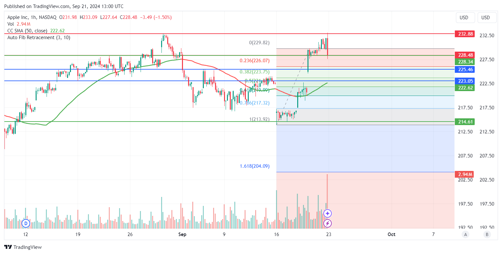

# Welcome to Gotti - Visualizer

This repository is to be used alongside **stock-alchemist**. It provides the FastAPI backend and chart visualizations, and shares a MySQL database with stock-alchemist for inter-service communication.



##  Docker Setup (Recommended — runs 24/7)

Both `gotti-visualize` and `stock-alchemist` run together from this directory.

### Prerequisites
- [Docker Desktop for Windows](https://www.docker.com/products/docker-desktop/)

### Steps

```powershell
# 1. Clone both repos side-by-side into the same parent folder
git clone <gotti-visualize-url>
git clone <stock-alchemist-url>

# 2. Enter gotti-visualize
cd gotti-visualize

# 3. Set up your environment variables
copy .env.example .env
# Edit .env and fill in DB_PASSWORD, API keys, etc.

# 4. Start the entire ecosystem
docker compose up -d --build
```

### Services

| Service | URL | Description |
|---|---|---|
| `gotti-api` | http://localhost:8000 | FastAPI — charts, key levels, DB browser |
| `gotti-api` docs | http://localhost:8000/docs | Swagger UI |
| `stock-alchemist` | http://localhost:8080 | Analysis engine + health |
| `mysql` | localhost:3306 | Shared database (internal only) |

### Useful commands

```powershell
docker compose ps                    # check all services are healthy
docker compose logs -f gotti-api     # stream gotti-api logs
docker compose logs -f stock-alchemist
docker compose down                  # stop everything (data persisted in volume)
docker compose down -v               # stop + wipe database volume
```

### Overview

The project is quite simple and has the following file structure

```none
gotti-visualize/
├── data/
├── indicators/
│   ├── data_processing.py
│   ├── indicator_calculations.py
│   └── visualization.py
├── tests/
│   ├── test_data_processing.py
│   ├── test_indicator_calculations.py
│   └── test_visualization.py
├── main.py
└── requirements.txt
```

### Setup

TA-LIB has been added to the project!! This means that numpy and pandas had to be downgraded as well!!
To install :

1. Create conda env.

```bash
conda create --name gotti python=3.12
conda activate 
```

 2. Install TALIB.

```python
conda install -c conda-forge libta-lib
conda install -c conda-forge ta-lib
```

3. Install requirements.

```python
cd path/to/project
pip install -r requirements.txt
```

### Common errors and workarounds

1. **Numpy and Pandas version conflict**
Downgrade numpy and pandas respectively

    ```python
    pip install "pandas<2.2.1" --force-reinstall 
    pip install "numpy<2.0.0" --force-reinstall 
    ```
2. **TA-LIB library missing**
For all TA-LIB related problems refer here: https://github.com/ta-lib/ta-lib-python
Or here : https://github.com/TA-Lib/ta-lib

### IMPORTANT

This repo might be used in the future **ONLY** to generate, preproccess and visualize data.
A new repo will be created to implement further data processing and machine learning models.
This is to ensure that the project remains clean, easy to understand and most important, beacuase numpy and pandas had to be downgraded to install TA-LIB.

### Visualisation

An oversimplified UI has been added to preview all sectors and all tickers registered under NASDAQ.
Volume and Market Cap filters have been applied to reduce cluttering and non-tradable (by my decision) symbols.To view simply run

```bash
cd .\data\
python app.py
```

And then proceed to

```bash
http://localhost:port/dashboard/
```

NOTE : Replace localhost:port with given parameters

### Contribution

We welcome contributions to this project! To contribute, please follow these steps:

1. **Fork the repository** to your own GitHub account.
2. **Clone the forked repository** to your local machine.
3. **Create a new branch** for your feature or bug fix:

    ```bash
    git checkout -b feature-name
    ```

4. **Make your changes** and commit them with clear and concise messages.
5. **Push your changes** to your forked repository:

    ```bash
    git push origin feature-name
    ```

6. **Create a pull request** from your branch to the main repository.

Please ensure your code adheres to the project's coding standards and includes appropriate tests.

### License

This project is licensed under the MIT License. See the [LICENSE](LICENSE) file for more details.


### Fibonacci levels 
Column	Fib Level
fib_0	0%
fib_236	23.6%
fib_382	38.2%
fib_500	50%
fib_618	61.8%
fib_786	78.6%
fib_1000	100%
For downtrend patterns (e.g., row 0: NVDA $169.54-$212.18), fib_0 = low price (169.54) and fib_1000 = high price (212.18), with retracement levels ascending between them.

For uptrend patterns (e.g., row 7: $169.54-$193.63), fib_0 = high price (193.63) and fib_1000 = low price (169.54), with retracement levels descending.

The entry_price matches fib_618 and stop_loss matches fib_786 as expected. All 11 trade setups have a risk_reward of 3.68.

